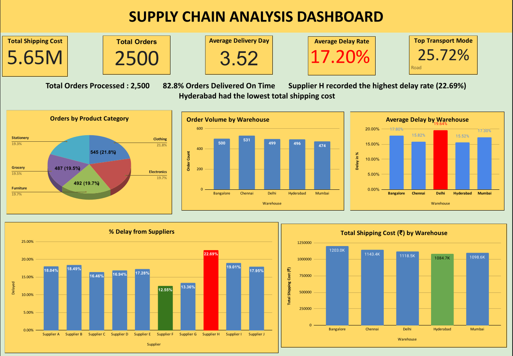

# Supply-Chain-Analysis
Supply Chain Analysis Dashboard built in Microsoft Excel.
# 📊 Supply Chain Analysis Dashboard

## Overview
This project presents a Supply Chain Analysis Dashboard built in Microsoft Excel to analyze business performance using key supply chain metrics.

## Features
- 📦 Total Orders
- 🚚 Total Shipping Cost
- ⏱️ Average Delivery Time
- 📉 Average Delay Rate
- 🚛 Top Transport Mode

## Tools Used
- Google Sheets
- Pivot Tables
- Pivot Charts
- Slicers
- Conditional Formatting

## Business Insights
- Identified the most frequently used transportation mode.
- Analyzed shipping costs across different orders.
- Measured delivery performance and delay rates.
- Created an interactive dashboard for business decision-making.

## Project File
- `Supply Chain Analysis.xlsx`

- ## Dashboard Preview

## Skills Demonstrated
- Data Cleaning
- Data Analysis
- Dashboard Design
- KPI Reporting
- Business Intelligence

## Author
**Akrish Chaurasia**
